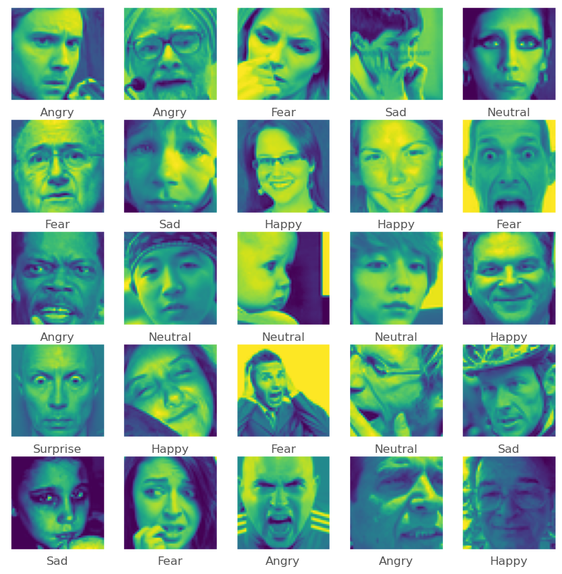
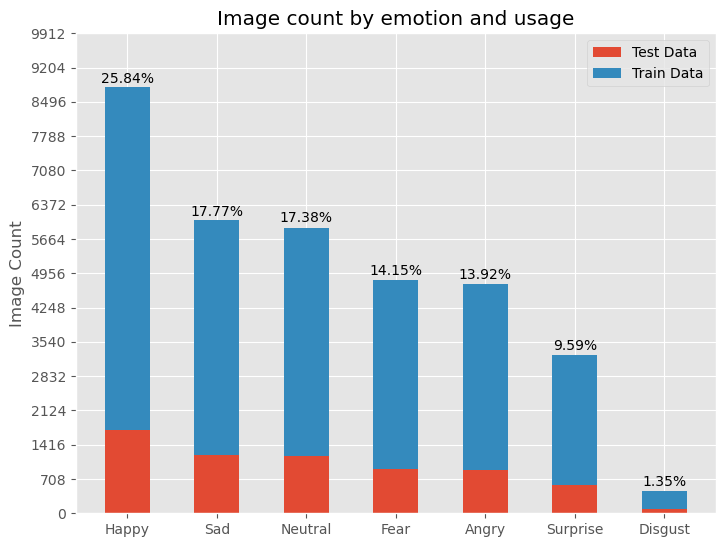
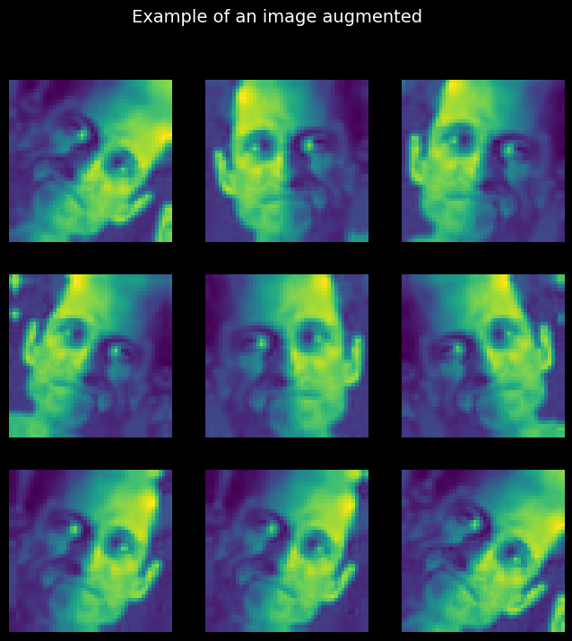
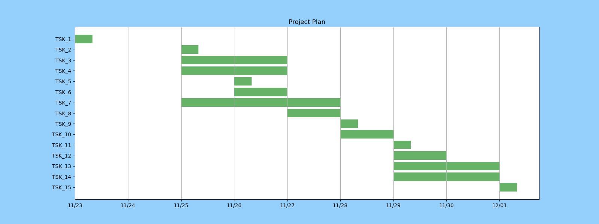

<a name="readme-top"></a>
<!--
*** Thanks for checking out the Best-README-Template. If you have a suggestion
*** that would make this better, please fork the repo and create a pull request
*** or simply open an issue with the tag "enhancement".
*** Don't forget to give the project a star!
*** Thanks again! Now go create something AMAZING! :D
-->


<!-- PROJECT SHIELDS -->
<!--
*** I'm using markdown "reference style" links for readability.
*** Reference links are enclosed in brackets [ ] instead of parentheses ( ).
*** See the bottom of this document for the declaration of the reference variables
*** for contributors-url, forks-url, etc. This is an optional, concise syntax you may use.
*** https://www.markdownguide.org/basic-syntax/#reference-style-links
-->

[![LinkedIn][linkedin-shield]][linkedin-url]


<!-- PROJECT LOGO -->
<br />
<!-- <div align="center">
  <a href="https://github.com/github_username/repo_name">
    
  </a> -->

<h3 align="center">Facial Expression Classification Model</h3>

  <p align="center">
For this project, I have developed and deployed a convolutional neural network (CNN) for facial expression recognition.
    <br />
    <a href="https://github.com/james-kidd/facial_expression_classifier"><strong>Explore the docs »</strong></a>
  </p>
</div>

<!-- TABLE OF CONTENTS -->


<!-- ABOUT THE PROJECT -->
## About The Project <a name="about"></a>

Facial expressions are a key aspect to how humans interact with each other to convey emotions. The ability to computationally recognize emotions is a key aspect of human-machine interfaces. I would like to showcase the various data-engineering skills I have developed the last few months.

![Demo Screen Shot][product-screenshot]


### Built With

* [![python][python]][python-url]
* [![tensorflow][tensorflow]][tensorflow-url]
* [![keras]][keras-url]
* [![flask][flask]][flask-url]
* [![numpy][numpy]][numpy-url]
* [![pandas][pandas]][pandas-url]
* [![matplotlib][matplotlib]][matplotlib-url]
* [![scipy][scipy]][scipy-url]
* [![jupyter][jupyter]][jupyter-url]

<p align="right">(<a href="#readme-top">back to top</a>)</p>


<!-- GETTING STARTED -->
## Data Preprocessing

### Importing the dataset
The [kaggle dataset](https://www.kaggle.com/competitions/challenges-in-representation-learning-facial-expression-recognition-challenge) was downloaded to train and test the model. The dataset contains a csv file `icml_face_data.csv` with columns **emotion**, **usage** and **pixels**. 

The dataset consist of **34034** rows of 48 by 48 grayscale pixels with the emotion classifcation labelled. The emotions labelled are one of seven categories *(0=Angry, 1=Disgust, 2=Fear, 3=Happy, 4=Sad, 5=Surprise, 6=Neutral)*

>`!kaggle competitions download challenges-in-representation-learning-facial-expression-recognition-challenge -f icml_face_data.csv`
 
### Data Cleaning
Reorganize csv file to be a pandas dataframe, with appropriate column variable types. Remove duplicate images and corrupted images from dataframe.
>`face_csv_to_df(csv_filepath)`

>`delete_duplicate_img(df)`

### Splitting the Data
Split data into the appropriate usage and emotion label. The data was split between 80% Training and 20% Testing.
```
.
├── data
│   ├── Training
│   │   ├── Angry
│   │   ├── Disgust
│   │   ├── Fear
│   │   ├── Happy
│   │   ├── Neutral
│   │   ├── Sad
│   │   ├── Suprise
│   │   
│   ├── Test
│       ├── ...
.   
```

### Visualize Data
#### Samples images of faces with emotion labels
<center>

</center></br>

It must be noted that the emotion classifcation labels of the facial expression images are interpreted by the authors of the dataset. An emotion interpreted by the model may be biased to the classified emotion label. 

#### Distribution of classses
<center>

</center> </br>
Through observing the figure above, it is evident that the dataset contains imbalanced occurrences of emotion types. This is especially noticable with the **Disgust** emotion class, only having a 1.35% share in the dataset.</br></br>

This imbalance will lead to the machine learning classifier to be more biased towards the majority classes. This will lead to low precision in classifying the minority classes.

<p align="right">(<a href="#readme-top">back to top</a>)</p>

## Model Design
### Data Augmentation
In order to increase the diversity of training set, random transformations to images in the training set was impemented. The augmentation to the training images will assist in managing the overfitting of the model.

<center>

</center> </br>

### Model Architecture
A deep convolutional neural network was designed. The model architecture consisted of 4 convolutional layers, paired with two fully connected (FC) layers. The Rectified Linear Unit (ReLU) activation function was used within all the layers.

```
.
├── 64 3x3 filters
│   ├── Batch Normalization
│   ├── Max Poolin g2D
│   ├── Dropout
│
├── 128 5x5 filters
│   ├── Batch Normalization
│   ├── Max Poolin g2D
│   ├── Dropout
│
├── 512 3x3 filters
│   ├── Batch Normalization
│   ├── Max Poolin g2D
│   ├── Dropout
│
├── 512 3x3 filters
│   ├── Batch Normalization
│   ├── Max Poolin g2D
│   ├── Dropout
│
├── FC layer (256 neurons)
│
├── FC layer (512 neurons)
.   
```

### Training
The model was trained for 40 epochs, with batche sizes of 128. The validation split of the training data was 20%. 

## Deployment

The model was deployed onto a Flask application. To deploy on a local host,

> `python deploy.py`


## Project Plan

<center>


|    Tsk | Task_Description                                |
|-------:|-------------------------------------------------|
| TSK_15 |                             Make github public. |
| TSK_14 |                   Implement model to dashboard. |
| TSK_13 |              Set up base hierarchy and styling. |
| TSK_12 | Generate visuals to demonstrate models success. |
| TSK_11 |                                     Tune model. |
| TSK_10 |                           Train and test model. |
|  TSK_9 |       Create checkpoints to save model weights. |
|  TSK_8 |   (Optional) Utilize a VM (AWS) to train model. |
|  TSK_7 |            Create CNN on GoogleColab enviroment |
|  TSK_6 |  Clean and organize Images (directory as well). |
|  TSK_5 |                              Set up GitHub repo |
|  TSK_4 |           Design layers and neurons within CNN. |
|  TSK_3 |                    Research optimal CNN design. |
|  TSK_2 |         Obtain labelled classification dataset. |
|  TSK_1 |                         Select Capstone project |
    
</center>


<!-- CONTACT -->
## Contact

James Kidd - [LinkedIn][linkedin-url]

Project Link: [facial expression classifier](https://github.com/james-kidd/facial_expression_classifier)


<p align="right">(<a href="#readme-top">back to top</a>)</p>


<!-- MARKDOWN LINKS & IMAGES -->
<!-- https://www.markdownguide.org/basic-syntax/#reference-style-links -->
[linkedin-shield]: https://img.shields.io/badge/-LinkedIn-black.svg?style=for-the-badge&logo=linkedin&colorB=555
[linkedin-url]: https://www.linkedin.com/in/james-kidd-mtl/

[product-screenshot]: static/demo_output.jpeg

[python]: https://img.shields.io/badge/Python-3776AB?style=for-the-badge&logo=python&logoColor=white
[python-url]: https://www.python.org/
[tensorflow]: https://img.shields.io/badge/TensorFlow-FF6F00?style=for-the-badge&logo=tensorflow&logoColor=white
[tensorflow-url]: https://www.tensorflow.org/
[keras]: https://img.shields.io/badge/Keras-%23D00000.svg?style=for-the-badge&logo=Keras&logoColor=white
[keras-url]: https://keras.io/
[matplotlib]: https://img.shields.io/badge/Matplotlib-%23ffffff.svg?style=for-the-badge&logo=Matplotlib&logoColor=black
[matplotlib-url]: https://matplotlib.org/
[numpy]: https://img.shields.io/badge/numpy-%23013243.svg?style=for-the-badge&logo=numpy&logoColor=white
[numpy-url]: https://numpy.org/
[pandas]: https://img.shields.io/badge/pandas-%23150458.svg?style=for-the-badge&logo=pandas&logoColor=white
[pandas-url]: https://pandas.pydata.org/
[scipy]: https://img.shields.io/badge/SciPy-%230C55A5.svg?style=for-the-badge&logo=scipy&logoColor=%white
[scipy-url]: https://scipy.org/
[flask]: https://img.shields.io/badge/flask-%23000.svg?style=for-the-badge&logo=flask&logoColor=white
[flask-url]: https://flask.palletsprojects.com/en/2.2.x/
[jupyter]: https://img.shields.io/badge/jupyter-%23FA0F00.svg?style=for-the-badge&logo=jupyter&logoColor=white
[jupyter-url]: https://jupyter.org/